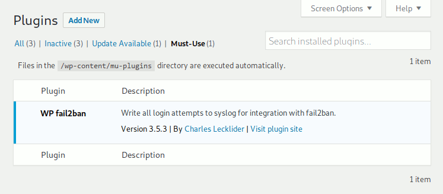

.. _installation:

============
Installation
============

.. _installation_already_installed:

Is *WP fail2ban* Already Installed?
-----------------------------------

*WP fail2ban* pre-installed in `mu-plugins` in a new DigitalOcean WordPress droplet.

.. _installation_overview:

Overview
--------

*WPf2b* installs just like any other WordPress plugin - you need do nothing differently.

Premium
^^^^^^^

The Premium version installs via Freemius.

Database
""""""""

Activating *WPf2b* Premium creates one database table, ``wp_fail2ban_log``.

*WPf2b* Premium never drops the database table - it's your data.

